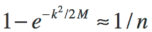
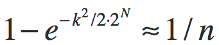
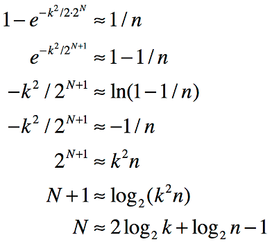

## EntropyString for Swift 

Efficiently generate cryptographically strong random strings of specified entropy from various character sets.

[](https://travis-ci.org/EntropyString/EntropyString-Swift) &nbsp; <a href="https://github.com/Carthage/Carthage"></a> &nbsp; <a href="https://cocoapods.org/pods/EntropyString"></a> &nbsp; [](https://cdn.rawgit.com/EntropyString/EntropyString-Swift/3f417062/LICENSE)

## <a name="TOC"></a>
 - [Installation](#Installation)
 - [TL;DR](#TLDR)
 - [Overview](#Overview)
 - [Real Need](#RealNeed)
 - [More Examples](#MoreExamples)
 - [Character Sets](#CharacterSets)
 - [Custom Characters](#CustomCharacters)
 - [Efficiency](#Efficiency)
 - [Secure Bytes](#SecureBytes)
 - [Custom Bytes](#CustomBytes)
 - [Entropy Bits](#EntropyBits)
 - [TL;DR 2](#TLDR2)

[TOC](#TOC)

### <a name="Installation"></a>Installation

#### Carthage

1. Add the project to your [Cartfile](https://github.com/Carthage/Carthage/blob/master/Documentation/Artifacts.md#cartfile).

    ```
    github "EntropyString/EntropyString-Swift.git"
    ```

2. Run `carthage update` and follow the [Carthage getting started steps](https://github.com/Carthage/Carthage#getting-started).

3. Import module EntropyString

    ```swift
    import EntropyString
    ```

#### CocoaPods

1. Add the project to your [Podfile](https://guides.cocoapods.org/using/the-podfile.html).

    ```ruby
    use_frameworks!
    pod 'EntropyString', '~> 3.0'
    ```

2. Run `pod install` and open the `.xcworkspace` file to launch Xcode.

3. Import module EntropyString 

    ```swift
    import EntropyString
    ```

#### Swift Package Manager

1. Add the project to your `Package.swift`.

    ```swift
    import PackageDescription

    let package = Package(
        name: "YourProject",
        dependencies: [
            .Package(url: "https://github.com/EntropyString/EntropyString-Swift.git",
                     majorVersion: 1)
        ]
    )
    ```

2. Import module EntropyString 

    ```swift
    import EntropyString
    ```

[TOC](#TOC)

----

The remainder of this README is included in the project as a Swift playground.

----

### <a name="TLDR"></a>TL;DR

  ```swift
  import EntropyString
  ```

Generate up to a _1 million_ random strings with _1 in a billion_ chance of repeat:

  ```swift
  var bits = Entropy.bits(for: 1.0e6, risk: 1.0e9)
  var entropy = Entropy()
  var string = entropy.string(bits: bits)
  ```

  > 2tF6bMNPqQ82Qj

See [Real Need](#RealNeed) for description of what entropy bits represents.  

`EntropyString` uses predefined `charset32` characters by default (reference [Character Sets](#CharacterSets)). To get a random hexadecimal string with the same entropy bits as above:

  ```swift
  entropy.use(.charset16)
  string = entropy.string(bits: bits)
  ```

  > a946ff97a1c4e64e79

Custom characters may be specified. Using uppercase hexadecimal characters:

  ```swift
  try! entropy.use("0123456789ABCDEF")
  string = entropy.string(bits: bits)
  ```

  > 78E3ACABE544EBA7DF

Convenience functions `smallID`, `mediumID`, `largeID`, `sessionID` and `token` provide random strings for various predefined bits of entropy. For example, a small id represents a potential of 30 strings with a 1 in a million chance of repeat:

  ```swift
  string = entropy.smallID()
  ```

  > 7A81129D
  
Or, to generate an OWASP session ID:

  ```swift
  string = entropy.sessionID()
  ```

  > CC287C99158BF152DF98AF36D5E92AE3

Or perhaps you need a 256 bit token using [RFC 4648](https://tools.ietf.org/html/rfc4648#section-5) file system and URL safe characters:
  ```swift
  string = entropy.token(.charset64)
  ```

  > X2AZRHuNN3mFUhsYzHSE_r2SeZJ_9uqdw-j9zvPqU2O

[TOC](#TOC)

### <a name="Overview"></a>Overview

`EntropyString` provides easy creation of randomly generated strings of specific entropy using various character sets. Such strings are needed as unique identifiers when generating, for example, random IDs and you don't want the overkill of a UUID.

A key concern when generating such strings is that they be unique. Guaranteed uniqueness, however, requires either deterministic generation (e.g., a counter) that is not random, or that each newly created random string be compared against all existing strings. When randomness is required, the overhead of storing and comparing strings is often too onerous and a different tack is chosen.

A common strategy is to replace the **_guarantee of uniqueness_** with a weaker but often sufficient one of **_probabilistic uniqueness_**. Specifically, rather than being absolutely sure of uniqueness, we settle for a statement such as *"there is less than a 1 in a billion chance that two of my strings are the same"*. We use an implicit version of this very strategy every time we use a hash set, where the keys are formed from taking the hash of some value. We *assume* there will be no hash collision using our values, but we **do not** have any true guarantee of uniqueness per se.

Fortunately, a probabilistic uniqueness strategy requires much less overhead than guaranteed uniqueness. But it does require we have some manner of qualifying what we mean by *"there is less than a 1 in a billion chance that 1 million strings of this form will have a repeat"*.

Understanding probabilistic uniqueness of random strings requires an understanding of [*entropy*](https://en.wikipedia.org/wiki/Entropy_(information_theory)) and of estimating the probability of a [*collision*](https://en.wikipedia.org/wiki/Birthday_problem#Cast_as_a_collision_problem) (i.e., the probability that two strings in a set of randomly generated strings might be the same). The blog post [Hash Collision Probabilities](http://preshing.com/20110504/hash-collision-probabilities/) provides an excellent overview of deriving an expression for calculating the probability of a collision in some number of hashes using a perfect hash with an N-bit output. This is sufficient for understanding the probability of collision given a hash with a **fixed** output of N-bits, but does not provide an answer to qualifying what we mean by *"there is less than a 1 in a billion chance that 1 million strings of this form will have a repeat"*. The [Entropy Bits](#EntropyBits) section below describes how `EntropyString` provides this qualifying measure.

We'll begin investigating `EntropyString` by considering the [Real Need](#RealNeed) when generating random strings.

[TOC](#TOC)

### <a name="RealNeed"></a>Real Need

Let's start by reflecting on the common statement: *I need random strings 16 characters long.*

Okay. There are libraries available that address that exact need. But first, there are some questions that arise from the need as stated, such as:

  1. What characters do you want to use?
  2. How many of these strings do you need?
  3. Why do you need these strings?

The available libraries often let you specify the characters to use. So we can assume for now that question 1 is answered with:

*Hexadecimal will do fine*.

As for question 2, the developer might respond:

*I need 10,000 of these things*.

Ah, now we're getting somewhere. The answer to question 3 might lead to a further qualification:

*I need to generate 10,000 random, unique IDs*.

And the cat's out of the bag. We're getting at the real need, and it's not the same as the original statement. The developer needs *uniqueness* across a total of some number of strings. The length of the string is a by-product of the uniqueness, not the goal, and should not be the primary specification for the random string.

As noted in the [Overview](#Overview), guaranteeing uniqueness is difficult, so we'll replace that declaration with one of *probabilistic uniqueness* by asking a fourth question:

<ol start=4>
  <li>What risk of a repeat are you willing to accept?</li>
</ol>

Probabilistic uniqueness contains risk. That's the price we pay for giving up on the stronger declaration of garuanteed uniqueness. But the developer can quantify an appropriate risk for a particular scenario with a statement like:

*I guess I can live with a 1 in a million chance of a repeat*.

So now we've finally gotten to the developer's real need:

*I need 10,000 random hexadecimal IDs with less than 1 in a million chance of any repeats*.

Not only is this statement more specific, there is no mention of string length. The developer needs probabilistic uniqueness, and strings are to be used to capture randomness for this purpose. As such, the length of the string is simply a by-product of the encoding used to represent the required uniqueness as a string.

How do you address this need using a library designed to generate strings of specified length?  Well, you don't, because that library was designed to answer the originally stated need, not the real need we've uncovered. We need a library that deals with probabilistic uniqueness of a total number of some strings. And that's exactly what `EntropyString` does.

Let's use `EntropyString` to help this developer generate 5 hexadecimal IDs from a pool of a potentail 10,000 IDs with a 1 in a milllion chance of a repeat:

  ```swift
  import EntropyString

  let bits = Entropy.bits(for: 10000, risk: 1.0e6)
  let entropy = Entropy(.charset16)
  
  var strings = [String]()
  for i in 0 ..< 5 {
    let string = entropy.string(bits: bits)
    strings.append(string)
  }
  print("Strings: \(strings)")
  ```

  > Strings: ["85e442fa0e83", "a74dc126af1e", "368cd13b1f6e", "81bf94e1278d", "fe7dec099ac9"]

Examining the above code,

  ```swift
  let bits = Entropy.bits(for: 10000, risk: 1.0e6)
  ```

is used to determine how much entropy is needed to satisfy the probabilistic uniqueness of a **1 in a million** risk of repeat in a total of **10,000** strings. We didn't print the result, but if you did you'd see it's about **45.51** bits. Then

  ```swift
  let entropy = Entropy(.charset16)
  ```

creates a `Entropy` instance configured to generated strings using the predefined hexadecimal characters provided by `.charset16`. Finally

  ```swift
  let string = entropy.string(bits: bits)
  ```

is used to actually generate the random strings of the specified entropy.

Looking at the IDs, we can see each is 12 characters long. Again, the string length is a by-product of the characters used to represent the entropy we needed. And it seems the developer didn't really need 16 characters after all.

Given that the strings are 12 hexadecimals long, each string actually has an information carrying capacity of 12 * 4 = 48 bits of entropy (a hexadecimal character carries 4 bits). That's fine. Assuming all characters are equally probable, a string can only carry entropy equal to a multiple of the amount of entropy represented per character. `EntropyString` produces the smallest strings that *exceed* the specified entropy.

[TOC](#TOC)

### <a name="MoreExamples"></a>More Examples

In [Real Need](#RealNeed) our developer used hexadecimal characters for the strings.  Let's look at using other characters instead.

We'll start with using 32 characters. What 32 characters, you ask? The [Character Sets](#CharacterSets) section discusses the predefined characters available in `EntropyString` and the [Custom Characters](#CustomCharacters) section describes how you can use whatever characters you want. By default, `EntropyString` uses `charset32` characters, so we don't need to pass that parameter into `Entropy()`.
  ```swift
  import EntropyString

  let entropy = Entropy()
  var bits = Entropy.bits(for: 10000, risk: 1.0e6)
  var string = entropy.string(bits: bits, using: .charset32)

  print("String: \(string)\n")
  ```

  > String: PmgMJrdp9h

We're using the same __bits__ calculation since we haven't changed the number of IDs or the accepted risk of probabilistic uniqueness. But this time we use 32 characters and our resulting ID only requires 10 characters (and can carry 50 bits of entropy).

As another example, let's assume we need to ensure the names of a handful of items are unique. `EntropyString.smallID` yields strings that have a 1 in a million chance of repeat in 30 strings.

  ```swift
  string = entropy.smallID()

  print("String: \(string)\n")
  ```

  > String: ThfLbm

Using the same `Entropy` instance, we can switch to the default `charset4` characters:

  ```swift
  entropy.use(charset: .charset64)
  string = entropy.smallID()
  print("String: \(string)\n")
  ```

  > String: CCCCTCAGGCATAGG

Okay, we probably wouldn't use 4 characters (and what's up with those characters?), but you get the idea.

Suppose we have a more extreme need. We want less than a 1 in a trillion chance that 10 billion strings repeat. Let's see, our risk (trillion) is 10 to the 12th and our total (10 billion) is 10 to the 10th, so:

  ```swift
  entropy.use(.charset32)
  bits = Entropy.bits(for: 1.0e10, risk: 1.0e12)
  string = entropy.string(bits: bits)
  ```

   > String: F78PmfGRNfJrhHGTqpt6Hn

Finally, let say we're generating session IDs. We're not interested in uniqueness per se, but in ensuring our IDs aren't predictable since we can't have the bad guys guessing a valid session ID. In this case, we're using entropy as a measure of unpredictability of the IDs. Rather than calculate our entropy, we declare it needs to be 128 bits (since we read on the OWASP web site that session IDs should be 128 bits).

  ```swift
  string = entropy.sessionID(.charset64)
  ```

  > String: b0Gnh6H5cKCjWrCLwKoeuN

Using 64 characters, our string length is 22 characters. That's actually `22*6 = 132` bits, so we've got our OWASP requirement covered! 😌

Also note that we covered our need using strings that are only 22 characters in length. So long to using GUID strings which only carry 122 bits of entropy (commonly used version 4) and use string representations that are 36 characters long (hex with dashes).

[TOC](#TOC)

### <a name="CharacterSets"></a>Character Sets

As we've seen in the previous sections, `EntropyString` provides predefined characters for each of the supported character sets. Let's see what's under the hood. The available `CharSet`s are *.charset64*, *.charset32*, *.charset16*, *.charset8*, *.charset4* and *.charset2*.

  ```swift
  import EntropyString

  print("Base 64: \(CharSet.charset64.chars)\n")
  print("Base 32: \(CharSet.charset32.chars)\n")
  print("Base 16: \(CharSet.charset16.chars)\n")
  print("Base  8: \(CharSet.charset8.chars)\n")
  print("Base  4: \(CharSet.charset4.chars)\n")
  print("Base  2: \(CharSet.charset2.chars)\n")
  ```

The characters for each were chosen as follows:

  - CharSet 64: **ABCDEFGHIJKLMNOPQRSTUVWXYZabcdefghijklmnopqrstuvwxyz0123456789-_**
      * The file system and URL safe char set from [RFC 4648](https://tools.ietf.org/html/rfc4648#section-5).
      &nbsp;
  - CharSet 32: **2346789bdfghjmnpqrtBDFGHJLMNPQRT**
      * Remove all upper and lower case vowels (including y)
      * Remove all numbers that look like letters
      * Remove all letters that look like numbers
      * Remove all letters that have poor distinction between upper and lower case values.
      The resulting strings don't look like English words and are easy to parse visually.
      &nbsp;
  - CharSet 16: **0123456789abcdef**
      * Hexadecimal
      &nbsp;
  - CharSet  8: **01234567**
      * Octal
      &nbsp;
  - CharSet  4: **ATCG**
      * DNA alphabet. No good reason; just wanted to get away from the obvious.
      &nbsp;
  - CharSet  2: **01**
      * Binary

You may, of course, want to choose the characters used, which is covered next in [Custom Characters](#CustomCharacters).

[TOC](#TOC)

### <a name="CustomCharacters"></a>Custom Characters

Being able to easily generate random strings is great, but what if you want to specify your own characters? For example, suppose you want to visualize flipping a coin to produce 10 bits of entropy.

  ```swift
  import EntropyString

  let entropy = Entropy(.charset2)
  var flips = entropy.string(bits: 10)
  
  print("flips: \(flips)\n")
  ```

  > flips: 0101001110

The resulting string of __0__'s and __1__'s doesn't look quite right. Perhaps you want to use the characters __H__ and __T__ instead.

  ```swift
  try! entropy.use("HT")
  flips = entropy.string(bits: 10)

  print("flips: \(flips)\n")
  ```

  > flips: HTTTHHTTHH

As another example, we saw in [Character Sets](#CharacterSets) the predefined hex characters for `charset16` are lowercase. Suppose you like uppercase hexadecimal letters instead.

  ```swift
  try! entropy.use("0123456789ABCDEF")
  let hex = entropy.string(bits: 48)

  print("hex: \(hex)\n")
  ```

  > hex: 4D20D9AA862C

The `Entropy` constructor allows for three separate cases:

  - No argument defaults to the `charset32` characters.
  - One of six predefined `CharSet`s can be specified.
  - A string representing the characters to use can be specified.
    
The last option above will throw an `EntropyStringError` if the characters string isn't appropriate for creating a `CharSet`.
  ```swift
  do {
    try entropy.use("abcdefg")
  }
  catch {
    print(error)
  }
  ```
  > invalidCharCount

  ```swift
  do {
    try entropy.use("01233210")
  }
  catch {
    print(error)
  }
  ```
  
  > charsNotUnique

[TOC](#TOC)

### <a name="Efficiency"></a>Efficiency

To efficiently create random strings, `EntropyString` generates the necessary number of random bytes needed for each string and uses those bytes in a bit shifting scheme to index into a character set. For example, to generate strings from the __32__ characters in the *charset32* character set, each index needs to be in the range `[0,31]`. Generating a random string of *charset32* characters is thus reduced to generating a random sequence of indices in the range `[0,31]`.

To generate the indices, `EntropyString` slices just enough bits from the random bytes to create each index. In the example at hand, 5 bits are needed to create an index in the range `[0,31]`. `EntropyString` processes the bytes 5 bits at a time to create the indices. The first index comes from the first 5 bits of the first byte, the second index comes from the last 3 bits of the first byte combined with the first 2 bits of the second byte, and so on as the bytes are systematically sliced to form indices into the character set. And since bit shifting and addition of byte values is really efficient, this scheme is quite fast.

The `EntropyString` scheme is also efficient with regard to the amount of randomness used. Consider the following common Swift solution to generating random strings. To generated a character, an index into the available characters is create using `arc4random_uniform`. The code looks something like:

  ```swift
  for _ in 0 ..< len {
    let offset = Int(arc4random_uniform(charCount))
    let index = chars.index(chars.startIndex, offsetBy: offset)
    let char = chars[index]
    string += String(char)
  }
  ```

In the code above, `arc4random_uniform` generates 32 bits of randomness per call, returned as an `UInt32`. The returned value is used to create **index**. Suppose we're creating strings with **len = 16** and **charCount = 32**. Generating each string character consumes 32 bits of randomness while only injecting 5 bits (`log2(32)`) of entropy into the resulting random string. The resulting string has an information carrying capacity of 16 * 5 = 80 bits, so creating each string requires a *total* of 512 bits of randomness while only actually *carrying* 80 bits of that entropy forward in the string itself. That means 432 bits (84% of the total) of the generated randomness is simply wasted.

Compare that to the `EntropyString` scheme. For the example above, slicing off 5 bits at a time requires a total of 80 bits (10 bytes). Creating the same strings as above, `EntropyString` uses 80 bits of randomness per string with no wasted bits. In general, the `EntropyString` scheme can waste up to 7 bits per string, but that's the worst case scenario and that's *per string*, not *per character*!

Fortunately you don't need to really understand how the bytes are efficiently sliced and diced to get the string. But you may want to know that [Secure Bytes](#SecureBytes) are used, and that's the next topic.

[TOC](#TOC)

### <a name="SecureBytes"></a>Secure Bytes

As described in [Efficiency](#Efficiency), `EntropyString` uses an underlying array of bytes to generate strings. The entropy of the resulting strings is, of course, directly related to the randomness of the bytes used. That's an important point. Strings are only capable of carrying information (entropy); the random bytes actually provide the entropy itself.

`EntropyString` automatically generates the necessary number of bytes needed to create a random string. On Apple OSes, `EntropyString` uses either `SecRandomCopyBytes` or `arc4random_buf`, both of which are cryptographically secure random number generators. `SecRandomCopyBytes` is the stronger of the two, but can fail if the system entropy pool lacks sufficient randomness. Rather than propagate that failure, if `SecRandomCopyBytes` fails `EntropyString` falls back and uses `arc4random_buf` to generate the bytes. Though not as strong, `arc4random_buf` does not fail.

You may, of course, want feedback as to when or if `SecRandomCopyBytes` fails. `Entropy.string(bits:secRand)` provides the `inout` parameter `secRand` that acts as a flag should a `SecRandomCopyBytes` call fail.

On Linux OSes, `EntropyString` always uses `arc4random_buf`. The `secRand` parameter is ignored.


  ```swift
  import EntropyString

  let entropy = Entropy()
  var secRand = true
  entropy.string(bits: 20, secRand: &secRand)
  ```

  > secRand: true

If `SecRandomCopyBytes` is used, the __secRand__ parameter will remain `true`; otherwise it will be set to `false`.

You can also pass in __secRand__ as `false`, in which case the `entropy` call will not attempt to use `SecRandomCopyBytes` and will use `arc4random_buf` instead.

  ```swift
  secRand = false
  entropy.string(bits: 20, secRand: &secRand)
  ```

Rather than have `EntropyString` generate bytes automatically, you can provide your own [Custom Bytes](#CustomBytes) to create a string, which is the next topic.

[TOC](#TOC)

### <a name="CustomBytes"></a>Custom Bytes

As described in [Secure Bytes](#SecureBytes), `EntropyString` automatically generates random bytes using either `SecRandomCopyBuf` or `arc4random_buf`. These functions are fine, but you may have a need to provide your own bytes for deterministic testing or to use a specialized byte generator. The function `entropy.string(bits:using)` allows specifying your own bytes to create a string.

Suppose we want a string capable of 30 bits of entropy using 32 characters. We pass in 4 bytes (to cover the 30 bits):

```swift
import EntropyString

let entropy = Entropy()
let bytes: [UInt8] = [250, 200, 150, 100]
let string = try! entropy.string(bits: 30, using: bytes)

print("String: \(string)\n")
```

> string: Th7fjL
 
The __bytes__ provided can come from any source. However, if the number of bytes is insufficient to generate the string as described in the [Efficiency](#Efficiency) section, an `EntropyStringError.tooFewBytes` is thrown.

```swift
do {
  try entropy.string(bits: 32, using: bytes)
}
catch {
  print(error)
}
```

> error: tooFewBytes

Note the number of bytes needed is dependent on the number of characters in the character set. For a string representation of entropy, we can only have multiples of the entropy bits per character. In the example above, each character represents 5 bits of entropy. So we can't get exactly 32 bits and we round up by the bits per character to a total 35 bits. We need 5 bytes (40 bits), not 4 (32 bits).

`CharSet.bytes_needed(bits)` can be used to determine the number of bytes needed to cover a specified amount of entropy for a given character set.

```swift
let bytes_needed = entropy.charset.bytesNeeded(bits: 32)

print("\nBytes needed: \(bytes_needed)\n")
```

> Bytes needed: 5

[TOC](#TOC)

### <a name="EntropyBits"></a>Entropy Bits

Thus far we've avoided the mathematics behind the calculation of the entropy bits required to specify a risk that some number random strings will not have a repeat. As noted in the [Overview](#Overview), the posting [Hash Collision Probabilities](http://preshing.com/20110504/hash-collision-probabilities/) derives an expression, based on the well-known [Birthday Problem](https://en.wikipedia.org/wiki/Birthday_problem#Approximations), for calculating the probability of a collision in some number of hashes (denoted by `k`) using a perfect hash with an output of `M` bits:



There are two slight tweaks to this equation as compared to the one in the referenced posting. `M` is used for the total number of possible hashes and an equation is formed by explicitly specifying that the expression in the posting is approximately equal to `1/n`.

More importantly, the above equation isn't in a form conducive to our entropy string needs. The equation was derived for a set number of possible hashes and yields a probability, which is fine for hash collisions but isn't quite right for calculating the bits of entropy needed for our random strings.

The first thing we'll change is to use `M = 2^N`, where `N` is the number of entropy bits. This simply states that the number of possible strings is equal to the number of possible values using `N` bits:



Now we massage the equation to represent `N` as a function of `k` and `n`:



The final line represents the number of entropy bits `N` as a function of the number of potential strings `k` and the risk of repeat of 1 in `n`, exactly what we want. Furthermore, the equation is in a form that avoids really large numbers in calculating `N` since we immediately take a logarithm of each large value `k` and `n`.

[TOC](#TOC)

### <a name="TLDR2"></a>TL;DR 2

#### Take Away

  - You don't need random strings of length L.
    - String length is a by-product, not a goal.
  - You don't need truly unique strings.
    - Uniqueness is too onerous. You'll do fine with probabilistically unique strings.
  - Probabilistic uniqueness involves measured risk.
    - Risk is measured as *"1 in __n__ chance of generating a repeat"*
    - Bits of entropy gives you that measure.
  - You need to a total of **_N_** strings with a risk **_1/n_** of repeat.
    - The characters are arbitrary.
  - You need `EntropyString`.
  
##### A million potential strings with a 1 billion chance of a repeat:
```swift
  import EntropyString

  let entropy = Entropy()
  let bits = Entropy.bits(for: 1.0e6, risk: 1.0e9)
  let string = entropy.string(bits: bits)
```

  > DdHrT2NdrHf8tM
  
[TOC](#TOC)
